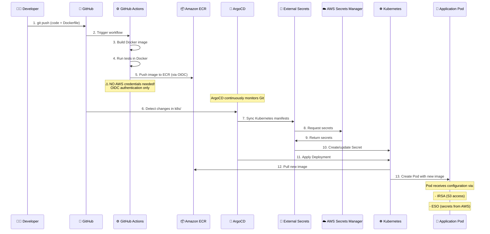
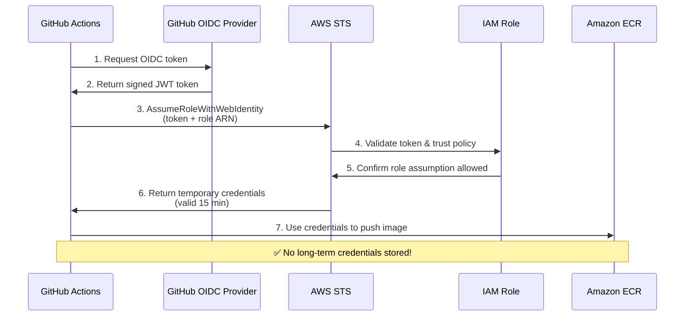

# Maritime QA Assistant - Complete Deployment Guide

**Version:** 2.0  
**Last Updated:** January 6, 2026

---

## Table of Contents

1. [Overview](#overview)
2. [Architecture](#architecture)
3. [GitOps Deployment Cycle](#gitops-deployment-cycle)
4. [Prerequisites](#prerequisites)
5. [Local Development](#local-development)
6. [Docker Deployment](#docker-deployment)
7. [AWS EKS Production Deployment](#aws-eks-production-deployment)
8. [CI/CD Pipeline with GitHub Actions](#cicd-pipeline-with-github-actions)
9. [Configuration Reference](#configuration-reference)
10. [Monitoring & Operations](#monitoring--operations)
11. [Troubleshooting](#troubleshooting)

---

## Overview

Maritime QA Assistant is an advanced RAG (Retrieval-Augmented Generation) system designed for technical maritime documentation. It uses an agentic LangGraph workflow to intelligently answer questions by dynamically selecting appropriate tools and data sources.

### Key Features

- **Agentic RAG Workflow**: LLM-based agent decides which tools to use at runtime
- **Multi-modal Context**: Text chunks, tables, schemas (P&ID diagrams), entities
- **Smart Entity Detection**: Automatic equipment code recognition and graph traversal
- **Intent Classification**: Automatically routes queries to appropriate data sources
- **S3 Integration**: Cloud-native document storage
- **Neo4j Knowledge Graph**: Rich domain model with relationships
- **Qdrant Vector Search**: Semantic search across all content types

---

## Architecture

### Technology Stack

| Component | Technology | Purpose |
|-----------|-----------|---------|
| **Frontend** | Streamlit | Chat UI, document upload, schema viewer |
| **Backend** | FastAPI | REST API, authentication, business logic |
| **Workflow Orchestration** | LangGraph | Agentic RAG pipeline |
| **Vector Database** | Qdrant | Embeddings for semantic search |
| **Graph Database** | Neo4j | Knowledge graph, entities, relationships |
| **Object Storage** | AWS S3 | PDF documents, extracted schemas, tables |
| **LLM Provider** | OpenAI / Groq / Cerebras | GPT-4o, GPT-4o-mini, Llama models |
| **Container Orchestration** | Kubernetes (EKS) | Production deployment |
| **Infrastructure as Code** | Terraform | AWS resource provisioning |
| **GitOps** | ArgoCD | Continuous deployment |

### System Architecture

```
┌─────────────────────────────────────────────────────────────────────┐
│                         User Interface                              │
│                     Streamlit (Port 8501)                          │
└────────────────────────┬────────────────────────────────────────────┘
                         │
                         ▼
┌─────────────────────────────────────────────────────────────────────┐
│                         Backend API                                 │
│                      FastAPI (Port 8000)                           │
│  ┌──────────────┬──────────────┬──────────────┬──────────────┐    │
│  │ /chat        │ /upload      │ /search      │ /health      │    │
│  │ endpoint     │ endpoint     │ endpoint     │ check        │    │
│  └──────┬───────┴──────┬───────┴──────┬───────┴──────┬───────┘    │
└─────────┼──────────────┼──────────────┼──────────────┼─────────────┘
          │              │              │              │
          ▼              ▼              ▼              ▼
┌─────────────────────────────────────────────────────────────────────┐
│                    LangGraph Workflow Engine                        │
│  ┌──────────────────────────────────────────────────────────────┐  │
│  │ Nodes:                                                        │  │
│  │  1. Intent Classification & Router                           │  │
│  │  2. Entity Detection (pre-agent processing)                  │  │
│  │  3. Agent (tool selection & execution)                       │  │
│  │  4. Context Builder (deduplication, ranking)                 │  │
│  │  5. LLM Reasoning (answer generation)                        │  │
│  │  6. Validator (intent compliance check)                      │  │
│  └──────────────────────────────────────────────────────────────┘  │
└─────────┬──────────────┬──────────────┬──────────────┬─────────────┘
          │              │              │              │
          ▼              ▼              ▼              ▼
┌──────────────┐  ┌──────────────┐  ┌──────────────┐  ┌──────────────┐
│   Qdrant     │  │    Neo4j     │  │   AWS S3     │  │   OpenAI     │
│   Vector DB  │  │   Graph DB   │  │   Storage    │  │   LLM API    │
│              │  │              │  │              │  │              │
│ Collections: │  │ - Documents  │  │ - PDFs       │  │ - GPT-4o     │
│ - text_chunks│  │ - Sections   │  │ - Schemas    │  │ - GPT-4o-mini│
│ - tables     │  │ - Entities   │  │ - Tables     │  │ - Embeddings │
│ - schemas    │  │ - Relations  │  │              │  │              │
└──────────────┘  └──────────────┘  └──────────────┘  └──────────────┘
```

---

## GitOps Deployment Cycle

Application deployment is fully automated through **ArgoCD**, which implements the **GitOps approach**: declarative Kubernetes resource configuration is stored in a Git repository, and ArgoCD automatically synchronizes the cluster state with the desired state in the repository.

### Complete Deployment Cycle



### Deployment Stages

| # | Stage | Component | Action | Duration |
|---|-------|-----------|--------|----------|
| 1 | **Code Push** | Developer | `git push` to repository | 1 sec |
| 2 | **Image Build** | GitHub Actions | Build Docker image + tests | 3-5 min |
| 3 | **Publication** | GitHub Actions → ECR | Push image to ECR (AWS credentials) | 1-2 min |
| 4 | **Change Detection** | ArgoCD | Poll Git every 3 min | 0-3 min |
| 5 | **Synchronization** | ArgoCD → K8s | Apply manifests | 10-30 sec |
| 6 | **Secrets** | ESO → AWS Secrets | Update Kubernetes Secret | 5-10 sec |
| 7 | **Deployment** | Kubernetes | Rolling update Pods | 30-60 sec |
| **Total** | | | **End-to-End** | **5-12 min** |

### GitOps Components

#### 1. GitHub Actions (CI Pipeline)
- **Workflow:** `.github/workflows/docker-build-push.yml`
- **Trigger:** Push to `main` branch
- **Steps:**
  1. Authentication via AWS Access Keys (from GitHub Secrets)
  2. Build Docker image (`--target production`)
  3. Run tests (`--target test`)
  4. Tag image: `<commit-sha>` + `latest`
  5. Push to ECR
- **Security:** IAM user credentials stored in GitHub Secrets

**🔒 Required GitHub Secrets:**
- ✅ **AWS_ACCESS_KEY_ID** - IAM user access key (create via `aws iam create-access-key`)
- ✅ **AWS_SECRET_ACCESS_KEY** - IAM user secret key
- Optional:
  - `AWS_ACCOUNT_ID` (not sensitive, for convenience)
  - `AWS_REGION` (not sensitive, default: us-east-1)
  - `ECR_REPOSITORY` (not sensitive, default: maritime-qa-app)
  - API keys for testing (e.g., `TEST_OPENAI_API_KEY`)

#### 2. ArgoCD (CD Pipeline)
- **Mode:** Automatic sync with self-heal
- **Monitoring Frequency:** Every 3 minutes
- **Source of Truth:** Git repository (`k8s/base/`)
- **Namespace:** `infra-tools` (ArgoCD) → `maritime-qa` (application)

#### 3. External Secrets Operator (ESO)
- **Purpose:** Synchronization AWS Secrets Manager → Kubernetes Secrets
- **Components:**
  - `ClusterSecretStore` - AWS connection
  - `ExternalSecret` - secrets mapping
  - `Secret` - Kubernetes secret (created automatically)
- **IRSA:** Access via IAM role (no credentials in Pod)

#### 4. IRSA (IAM Roles for Service Accounts)
- **Application Pod:** S3 access (read/write files)
- **ESO:** Secrets Manager access (read secrets)
- **GitHub Actions:** ECR access (publish images) - uses IAM user with Access Keys

**Authentication Methods by Component:**

| Component | Authentication | Credentials Location |
|-----------|---------------|---------------------|
| **GitHub Actions** | AWS Access Keys (IAM user) | ✅ GitHub Secrets |
| **Application Pods** | IRSA (K8s ServiceAccount) | ❌ No secrets in Pod |
| **External Secrets** | IRSA (K8s ServiceAccount) | ❌ No secrets in ESO |
| **Runtime Secrets** | AWS Secrets Manager | ✅ Managed by AWS |

**Security Notes:**
- GitHub Actions uses dedicated IAM user `github-actions-maritime-qa` with minimal ECR-only permissions
- Access keys stored securely in GitHub repository secrets (encrypted at rest)
- Rotate keys periodically using `aws iam create-access-key` command

### Comparison with Traditional CI/CD

| Aspect | Traditional CI/CD | GitOps (ArgoCD) |
|--------|-------------------|-----------------|
| **Deployment trigger** | CI pipeline push to cluster | ArgoCD pull from Git |
| **Source of truth** | CI scripts + configs | Git repository |
| **Rollback** | Manually via kubectl/helm | `git revert` + auto-sync |
| **Drift detection** | ❌ None | ✅ Automatic (self-heal) |
| **Audit trail** | CI logs (temporary) | Git history (permanent) |
| **Credentials** | Stored in CI (secrets) | Minimal (IRSA for pods, Access Keys for CI) |
| **Multi-cluster** | Complex | Simple (1 ArgoCD → N clusters) |

### Data Flow

1. **User Query** → Frontend (Streamlit)
2. **API Request** → Backend (FastAPI `/chat` endpoint)
3. **Intent Classification** → LangGraph determines query type (text/table/schema/mixed)
4. **Entity Detection** → Extract equipment codes, component names from query
5. **Agent Tool Selection** → Choose appropriate tools:
   - `qdrant_search_text` - semantic text search
   - `qdrant_search_tables` - table search
   - `qdrant_search_schemas` - schema/diagram search
   - `neo4j_entity_search` - entity-based graph traversal
6. **Context Building** → Deduplicate, rank, and merge retrieved content
7. **LLM Reasoning** → Generate answer with citations
8. **Response** → Return formatted answer with references

---

## Prerequisites

### Required Accounts & Services

1. **Neo4j AuraDB** (or self-hosted Neo4j 5.x)
   - Free tier available at [neo4j.com/aura](https://neo4j.com/aura)
   - Minimum: 1GB RAM, 8GB storage

2. **OpenAI API** (required for embeddings)
   - Get API key at [platform.openai.com](https://platform.openai.com)
   - Models used: `text-embedding-3-small`, `gpt-4o-mini`, `gpt-4o`

3. **Groq API** (recommended for fast inference) OR **Cerebras API**
   - Groq: [console.groq.com](https://console.groq.com) - Free tier available
   - Cerebras: [inference.cerebras.ai](https://inference.cerebras.ai)

4. **AWS Account** (for S3 storage and EKS deployment)
   - S3 bucket for document storage
   - Optional: EKS cluster for production

### Local Development Requirements

- **Docker** 20.10+ and **Docker Compose** 2.0+
- **Python** 3.10+ (if running without Docker)
- At least **4GB RAM** available
- **Git** for version control

### Production Deployment Requirements

- **Terraform** 1.5+ (infrastructure provisioning)
- **kubectl** 1.28+ (Kubernetes CLI)
- **AWS CLI** 2.x (AWS access)
- **ArgoCD** (for GitOps deployment)

---

## Local Development

### Quick Start (5 minutes)

1. **Clone Repository**
   ```bash
   git clone https://github.com/KristinaKuzmenko/maritime-qa-assistant.git
   cd maritime-qa-assistant/maritime-qa-assistant
   ```

2. **Configure Environment**
   ```bash
   cp .env.example .env
   nano .env  # Edit with your credentials
   ```

   **Minimum Required Configuration:**
   ```bash
   # Neo4j
   NEO4J_URI=neo4j+s://xxxxx.databases.neo4j.io
   NEO4J_PASSWORD=your_password

   # OpenAI (required for embeddings)
   OPENAI_API_KEY=sk-proj-xxxxx

   # LLM Provider (choose one)
   GROQ_API_KEY=gsk_xxxxx                   
   # OR
   CEREBRAS_API_KEY=csk-xxxxx

   # Storage
   STORAGE_TYPE=s3
   S3_BUCKET_NAME=maritime-qa-files
   S3_REGION=us-east-1
   AWS_ACCESS_KEY_ID=AKIA...
   AWS_SECRET_ACCESS_KEY=your_secret

   # Authentication
   AUTH_SECRET_KEY=your-secret-key-min-32-chars
   ```

3. **Start Services**
   ```bash
   # Using Make (recommended)
   make up

   # OR using Docker Compose directly
   docker-compose -f docker-compose.dev.yml up -d
   ```

4. **Access Application**
   - Frontend: http://localhost:8501
   - Backend API: http://localhost:8000
   - API Docs: http://localhost:8000/docs

5. **Upload Documents**
   - Open frontend at http://localhost:8501
   - Navigate to "Upload Documents" page
   - Upload PDF technical manuals
   - Processing will extract text, tables, and schemas automatically

6. **Ask Questions**
   - Go to "Chat" page
   - Try: *"What are the clearance tolerances for crosshead bearings?"*
   - System will retrieve relevant context and generate answer with citations

### Development Commands

```bash
# View logs
docker-compose logs -f

# Restart services
docker-compose restart

# Stop services
docker-compose down

# Rebuild after code changes
docker-compose build
docker-compose up -d

# Run tests
docker build --target test -t maritime-qa-app:test .

# Shell into backend container
docker-compose exec backend bash

# Check Neo4j connection
docker-compose exec backend python -c "from core.config import settings; print(settings.neo4j_uri)"
```

---

## Docker Deployment

### Multi-Stage Dockerfile

The project uses a multi-stage Dockerfile optimized for CI/CD:

```dockerfile
# Stage 1: base - system dependencies + production packages
FROM python:3.10-slim as base
RUN apt-get update && apt-get install -y \
    tesseract-ocr poppler-utils libgl1 ...
COPY requirements.txt .
RUN pip install --no-cache-dir -r requirements.txt

# Stage 2: test - run unit tests
FROM base as test
COPY requirements-test.txt .
RUN pip install --no-cache-dir -r requirements-test.txt
COPY backend/ ./backend/
COPY frontend/ ./frontend/
ENV NEO4J_PASSWORD=test_password \
    OPENAI_API_KEY=test_key \
    AUTH_SECRET_KEY=test_secret_key_minimum_32_characters_long
RUN pytest backend/tests/ -v --tb=short -m "not integration" \
    --ignore=backend/tests/test_evaluation_metrics.py \
    --deselect=backend/tests/test_workflow.py::TestLLMInstance::test_groq_missing_key_raises

# Stage 3: production - clean final image
FROM base as production
COPY backend/ ./backend/
COPY frontend/ ./frontend/
COPY docker-entrypoint.sh .
RUN chmod +x docker-entrypoint.sh
EXPOSE 8000 8501
ENTRYPOINT ["/app/docker-entrypoint.sh"]
```

### Build & Push to ECR

```bash
# CI/CD Pipeline Steps

# Step 1: Run Tests
docker build --target test -t maritime-qa-app:test .

# Step 2: Build Production Image (if tests pass)
docker build --target production \
  -t 930953062641.dkr.ecr.us-east-1.amazonaws.com/maritime-qa-app:latest .

# Step 3: Login to ECR
aws ecr get-login-password --region us-east-1 | \
  docker login --username AWS --password-stdin \
  930953062641.dkr.ecr.us-east-1.amazonaws.com

# Step 4: Push to Registry
docker push 930953062641.dkr.ecr.us-east-1.amazonaws.com/maritime-qa-app:latest
```

### Docker Compose Profiles

The project includes multiple compose files for different environments:

| File | Purpose | Services |
|------|---------|----------|
| `docker-compose.yml` | Local dev (Qdrant included) | app + qdrant |
| `docker-compose.dev.yml` | Dev with cloud Qdrant | app only |
| `docker-compose.prod.yml` | Production config | app only |

---

## AWS EKS Production Deployment

### Infrastructure Architecture

```
┌─────────────────────────────────────────────────────────────────────┐
│                           AWS Account                               │
│                         (us-east-1)                                 │
├─────────────────────────────────────────────────────────────────────┤
│                                                                     │
│  ┌────────────────────────────────────────────────────────────┐   │
│  │                      VPC (10.0.0.0/16)                     │   │
│  │  ┌─────────────────────────────────────────────────────┐   │   │
│  │  │  EKS Cluster: maritime-qa-dev                       │   │   │
│  │  │  ┌──────────────┐  ┌──────────────┐  ┌──────────┐  │   │   │
│  │  │  │ App Pod      │  │ Qdrant Pod   │  │ ArgoCD   │  │   │   │
│  │  │  │ - Backend    │  │ - Vector DB  │  │ - GitOps │  │   │   │
│  │  │  │ - Frontend   │  │ - Persistent │  │          │  │   │   │
│  │  │  │ - IRSA role  │  │   Volume     │  │          │  │   │   │
│  │  │  └──────┬───────┘  └──────────────┘  └──────────┘  │   │   │
│  │  └─────────┼──────────────────────────────────────────┘   │   │
│  └────────────┼──────────────────────────────────────────────┘   │
│               │                                                   │
│  ┌────────────┼──────────────────────────────────────────────┐   │
│  │  IAM       ▼                                              │   │
│  │  ┌─────────────────┐  ┌─────────────────┐              │   │
│  │  │ App IRSA Role   │  │ ESO IRSA Role   │              │   │
│  │  │ - S3 Access     │  │ - Secrets Mgr   │              │   │
│  │  └─────────────────┘  └─────────────────┘              │   │
│  └────────────┬─────────────────┬────────────────────────────┘   │
│               │                 │                                │
│  ┌────────────▼─────────────────▼────────────────────────────┐   │
│  │                    S3 Buckets                             │   │
│  │  ┌────────────────────┐  ┌──────────────────────────┐    │   │
│  │  │ maritime-qa-files  │  │ maritime-qa-qdrant-      │    │   │
│  │  │ - PDFs             │  │   backups                │    │   │
│  │  │ - Schemas (PNG)    │  │ - Daily snapshots        │    │   │
│  │  │ - Tables (PNG)     │  │ - Point-in-time recovery │    │   │
│  │  └────────────────────┘  └──────────────────────────┘    │   │
│  └───────────────────────────────────────────────────────────┘   │
│                                                                   │
│  ┌───────────────────────────────────────────────────────────┐   │
│  │                  ECR Repository                           │   │
│  │  930953062641.dkr.ecr.us-east-1.amazonaws.com/           │   │
│  │    maritime-qa-app:latest                                │   │
│  └───────────────────────────────────────────────────────────┘   │
│                                                                   │
│  ┌───────────────────────────────────────────────────────────┐   │
│  │              AWS Secrets Manager                          │   │
│  │  maritime-qa/dev/app                                      │   │
│  │  - NEO4J_PASSWORD                                         │   │
│  │  - OPENAI_API_KEY                                         │   │
│  │  - GROQ_API_KEY                                           │   │
│  │  - AUTH_SECRET_KEY                                        │   │
│  └───────────────────────────────────────────────────────────┘   │
└─────────────────────────────────────────────────────────────────────┘
```

### Step 0: Create S3 Bucket for Terraform State (One-time Setup)

Before provisioning infrastructure, create an S3 bucket to store Terraform state files. This bucket should be **unique globally** across all AWS accounts.

```bash
# Choose a unique bucket name (replace with your own)
export TF_STATE_BUCKET="maritime-qa-terraform-state-$(aws sts get-caller-identity --query Account --output text)"
export AWS_REGION="us-east-1"

# Create S3 bucket for Terraform state
aws s3api create-bucket \
  --bucket $TF_STATE_BUCKET \
  --region $AWS_REGION

# Enable versioning (recommended for state recovery)
aws s3api put-bucket-versioning \
  --bucket $TF_STATE_BUCKET \
  --versioning-configuration Status=Enabled

# Enable encryption
aws s3api put-bucket-encryption \
  --bucket $TF_STATE_BUCKET \
  --server-side-encryption-configuration '{
    "Rules": [{
      "ApplyServerSideEncryptionByDefault": {
        "SSEAlgorithm": "AES256"
      }
    }]
  }'

# Block public access
aws s3api put-public-access-block \
  --bucket $TF_STATE_BUCKET \
  --public-access-block-configuration \
    "BlockPublicAcls=true,IgnorePublicAcls=true,BlockPublicPolicy=true,RestrictPublicBuckets=true"

echo "Terraform state bucket created: s3://$TF_STATE_BUCKET"
```

**Configure backend in all Terraform modules:**

Update `backend.tf` in each Terraform directory (`aws/infrastructure/`, `aws/storage/`, `aws/argocd/`):

```hcl
terraform {
  backend "s3" {
    bucket         = "maritime-qa-terraform-state"  # Replace with your bucket name
    key            = "infrastructure/terraform.tfstate"           # Unique key per module
    region         = "us-east-1"
    encrypt        = true
    dynamodb_table = "terraform-state-lock"                      # Optional: for state locking
  }
}
```

**Note:** Use different `key` values for each module:
- `aws/infrastructure/` → `key = "infrastructure/terraform.tfstate"`
- `aws/storage/` → `key = "storage/terraform.tfstate"`
- `aws/argocd/` → `key = "argocd/terraform.tfstate"`

### Step 1: Provision Infrastructure with Terraform

**Important:** Terraform manages only base infrastructure (VPC, EKS, ECR, IAM). Helm charts (Load Balancer Controller, External Secrets, Metrics Server) are installed separately via Helm CLI or managed by ArgoCD.

```bash
cd aws/infrastructure

# Initialize Terraform (will configure S3 backend)
terraform init

# Preview changes
terraform plan

# Apply infrastructure (creates VPC, EKS, ECR, IAM roles)
terraform apply -auto-approve

# If you get error "RepositoryAlreadyExistsException" (ECR repo from previous deployment):
terraform import module.ecr.aws_ecr_repository.backend maritime-qa-app
terraform apply -auto-approve

# Output will show:
# - cluster_name
# - cluster_endpoint
# - ecr_repository_url
# - app_role_arn (IRSA for S3 access)
```

**To destroy and recreate infrastructure:**

```bash
# Step 1: Delete Kubernetes Ingress/Service (AWS Load Balancer Controller creates ALB/NLB)
kubectl delete ingress --all -n maritime-qa
kubectl delete svc --all -n maritime-qa

# Step 2: CRITICAL - Delete Load Balancers created by AWS LB Controller
# These block VPC deletion (not managed by Terraform)
aws elbv2 describe-load-balancers --region us-east-1 \
  --query 'LoadBalancers[?contains(LoadBalancerName, `k8s-maritime`)].LoadBalancerArn' \
  --output text | xargs -I {} aws elbv2 delete-load-balancer --load-balancer-arn {} --region us-east-1

# Step 3: Delete Security Groups created by Kubernetes
aws ec2 describe-security-groups --region us-east-1 \
  --filters "Name=vpc-id,Values=<VPC_ID>" \
  --query 'SecurityGroups[?GroupName!=`default`].GroupId' \
  --output text | xargs -I {} aws ec2 delete-security-group --group-id {} --region us-east-1

# Step 4: Destroy Terraform infrastructure
cd aws/infrastructure
terraform destroy -auto-approve

# If you want to keep ECR (recommended to preserve images):
terraform destroy -auto-approve \
  -target=module.eks \
  -target=module.vpc \
  -target=aws_iam_role.app \
  -target=aws_iam_role.qdrant \
  -target=aws_iam_role.external_secrets \
  -target=aws_iam_role_policy_attachment.app_s3 \
  -target=aws_iam_role_policy.app_cloudwatch

# Step 5: Recreate infrastructure
# If you get error "RepositoryAlreadyExistsException" (ECR repo from previous deployment):
terraform import module.ecr.aws_ecr_repository.backend maritime-qa-app
terraform apply -auto-approve

# Step 4: Configure kubectl
aws eks update-kubeconfig --region us-east-1 --name maritime-qa-dev

# Step 5: Create DynamoDB table and add permissions (Step 2 below)
# Step 6: IMPORTANT - Reinstall all Helm components (they were deleted with cluster)
# - External Secrets Operator (Step 6 below) - REQUIRED FIRST
# - AWS Load Balancer Controller (Step 10 below)
# Step 7: Deploy ArgoCD (Step 7 below)
# Step 8: Deploy application via ArgoCD (Step 8 below)
```

### Step 2: Create DynamoDB Table for User Authentication

**Note:** DynamoDB table is used to store user credentials for authentication. This must be created before deploying the application.

```bash
# Create DynamoDB table for users
aws dynamodb create-table \
  --table-name dev-maritime-qa-users \
  --attribute-definitions AttributeName=username,AttributeType=S \
  --key-schema AttributeName=username,KeyType=HASH \
  --billing-mode PAY_PER_REQUEST \
  --region us-east-1

# Verify table was created
aws dynamodb describe-table --table-name dev-maritime-qa-users --region us-east-1
```

**Add DynamoDB permissions to application IAM role:**

The application pods need permission to read/write to DynamoDB table for user authentication.

```bash
# Create IAM policy document for DynamoDB access
cat > /tmp/dynamodb-policy.json <<'EOF'
{
  "Version": "2012-10-17",
  "Statement": [
    {
      "Effect": "Allow",
      "Action": [
        "dynamodb:GetItem",
        "dynamodb:PutItem",
        "dynamodb:UpdateItem",
        "dynamodb:DeleteItem",
        "dynamodb:Scan",
        "dynamodb:Query"
      ],
      "Resource": "arn:aws:dynamodb:us-east-1:*:table/dev-maritime-qa-users"
    }
  ]
}
EOF

# Create IAM policy
aws iam create-policy \
  --policy-name maritime-qa-dynamodb-access \
  --policy-document file:///tmp/dynamodb-policy.json \
  --region us-east-1

# Attach policy to app role (created by Terraform in Step 1)
aws iam attach-role-policy \
  --role-name maritime-qa-dev-app-role \
  --policy-arn arn:aws:iam::$(aws sts get-caller-identity --query Account --output text):policy/maritime-qa-dynamodb-access

# Verify policy is attached
aws iam list-attached-role-policies --role-name maritime-qa-dev-app-role
```

**Create initial admin user:**

#  Create user manually via AWS CLI
aws dynamodb put-item \
  --table-name dev-maritime-qa-users \
  --item '{
    "username": {"S": "admin"},
    "password_hash": {"S": "$2b$12$LQv3c1yqBWVHxkd0LHAkCOYz6TtxMQJqhN8/LewY5GyYIxF6O4yQC"},
    "name": {"S": "Administrator"},
    "role": {"S": "admin"},
    "email": {"S": "admin@example.com"}
  }' \
  --region us-east-1

# Default credentials: admin / admin
# Change password after first login!
```

### Step 3: Create S3 Buckets with Unique Names

**Important:** S3 bucket names must be **globally unique** across all AWS accounts. Replace the default bucket names with your own unique names.

```bash
cd aws/storage

# Edit variables.tf or use tfvars to set unique bucket names
cat > terraform.tfvars <<EOF
project_name    = "maritime-qa"
environment     = "dev"
aws_region      = "us-east-1"

# Use unique bucket names (append account ID or random suffix)
app_bucket_name    = "maritime-qa-files-$(aws sts get-caller-identity --query Account --output text)"
backup_bucket_name = "maritime-qa-qdrant-backups-$(aws sts get-caller-identity --query Account --output text)"
EOF

# Apply storage resources
terraform init
terraform apply -auto-approve

# Creates:
# - maritime-qa-files-<account-id> (app documents: PDFs, schemas, tables)
# - maritime-qa-qdrant-backups-<account-id> (Qdrant snapshots)
```

**Update application configuration** with your actual bucket names:
- In `k8s/base/configmap.yaml`: Set `S3_BUCKET_NAME` to your unique bucket name
- In AWS Secrets Manager: Update bucket references if stored there
- In `.env` file: Update `S3_BUCKET_NAME` for local development

### Step 4: Store Secrets in AWS Secrets Manager

**Important:** 
- Update secret values to match your actual bucket names if you customized them in Step 2.
- **Secrets persist across cluster recreations** - AWS Secrets Manager is independent of EKS. You only need to create secrets once, not after each `terraform destroy/apply` cycle.

```bash
# Create secrets JSON file
cat > maritime-qa-dev-app.secret.json <<EOF
{
  "NEO4J_URI": "neo4j+s://xxxxx.databases.neo4j.io",
  "NEO4J_PASSWORD": "your_neo4j_password",
  "OPENAI_API_KEY": "sk-proj-xxxxx",
  "GROQ_API_KEY": "gsk_xxxxx",
  "AUTH_SECRET_KEY": "your-secret-key-minimum-32-characters",
  "S3_BUCKET_NAME": "maritime-qa-files",
  "S3_REGION": "us-east-1"
}
EOF

# Upload to Secrets Manager
aws secretsmanager create-secret \
  --region us-east-1 \
  --name maritime-qa/dev/app \
  --secret-string file://maritime-qa-dev-app.secret.json

# Or update existing secret
aws secretsmanager put-secret-value \
  --region us-east-1 \
  --secret-id maritime-qa/dev/app \
  --secret-string file://maritime-qa-dev-app.secret.json

# Clean up local file
rm maritime-qa-dev-app.secret.json
```

### Step 5: Configure kubectl

```bash
# Update kubeconfig
aws eks update-kubeconfig --region us-east-1 --name maritime-qa-dev

# Verify connection
kubectl get nodes
kubectl get namespaces
```

### Step 6: Install External Secrets Operator

**Note:** This must be installed **before** deploying the application, as the app depends on External Secrets to inject credentials.

#### 6.1: Install ESO via Helm

```bash
# Configure kubectl
aws eks update-kubeconfig --region us-east-1 --name maritime-qa-dev

# Add Helm repo
helm repo add external-secrets https://charts.external-secrets.io
helm repo update

# Install ESO
helm install external-secrets \
  external-secrets/external-secrets \
  -n external-secrets \
  --create-namespace \
  --set installCRDs=true

# Verify installation
kubectl get pods -n external-secrets
# Should show 3 pods: external-secrets, cert-controller, webhook

kubectl get crd | grep external-secrets
# Should show: clustersecretstores, externalsecrets, secretstores
```

#### 6.2: Configure IRSA (IAM Role for Service Account)

**Critical:** ESO needs AWS IAM permissions to read from Secrets Manager.

```bash
# Get the IAM role name (created by Terraform)
aws iam list-roles --query 'Roles[?contains(RoleName, `external-secrets`)].RoleName' --output text
# Should output: maritime-qa-dev-external-secrets-role

# Annotate ServiceAccount with IRSA role
kubectl annotate serviceaccount -n external-secrets external-secrets \
  eks.amazonaws.com/role-arn=arn:aws:iam::930953062641:role/maritime-qa-dev-external-secrets-role \
  --overwrite

# Restart ESO pods to pick up new annotation
kubectl rollout restart deployment -n external-secrets external-secrets

# Wait for pods to restart
kubectl get pods -n external-secrets -w
```

#### 6.3: Verify External Secrets Setup

After deploying the application (Step 7), verify that secrets are syncing:

```bash
# Check ClusterSecretStore status
kubectl get clustersecretstore aws-secretsmanager
# STATUS should be "Valid"

# Check ExternalSecret status (after app deployment)
kubectl get externalsecret -n maritime-qa maritime-qa-secrets
# STATUS should be "SecretSynced"

# Verify Kubernetes Secret was created
kubectl get secret -n maritime-qa maritime-qa-secrets
# Should exist and contain keys from AWS Secrets Manager

# View secret keys (not values)
kubectl describe secret -n maritime-qa maritime-qa-secrets
```

#### 6.4: Troubleshooting External Secrets

**Issue: ClusterSecretStore shows "InvalidProviderConfig"**

```bash
# Check ESO ServiceAccount has IRSA annotation
kubectl get sa -n external-secrets external-secrets -o yaml | grep eks.amazonaws.com/role-arn

# If missing, add annotation:
kubectl annotate serviceaccount -n external-secrets external-secrets \
  eks.amazonaws.com/role-arn=arn:aws:iam::930953062641:role/maritime-qa-dev-external-secrets-role \
  --overwrite

kubectl rollout restart deployment -n external-secrets external-secrets
```

**Issue: ExternalSecret shows "SecretSyncedError"**

```bash
# Get detailed error message
kubectl describe externalsecret -n maritime-qa maritime-qa-secrets

# Common errors:
# 1. "secret not found" - Secret doesn't exist in AWS Secrets Manager
aws secretsmanager get-secret-value --region us-east-1 --secret-id maritime-qa/dev/app

# 2. "access denied" - IAM role lacks permissions
aws iam get-role-policy --role-name maritime-qa-dev-external-secrets-role --policy-name SecretsManagerReadAccess

# 3. "ClusterSecretStore not ready" - IRSA not configured (see above)
```

**Check ESO logs:**

```bash
kubectl logs -n external-secrets -l app.kubernetes.io/name=external-secrets --tail=50
```

### Step 7: Deploy ArgoCD

```bash
cd aws/argocd

# Initialize Terraform
terraform init

# Apply ArgoCD resources
terraform apply -auto-approve

# Get ArgoCD admin password
kubectl -n infra-tools get secret argocd-initial-admin-secret \
  -o jsonpath="{.data.password}" | base64 -d

# Port-forward to access UI
kubectl port-forward svc/argocd-server -n infra-tools 8080:443

# Access at: https://localhost:8080
# Username: admin
# Password: (from above command)
```

### Step 8: Deploy Application with ArgoCD

ArgoCD automatically syncs from Git repository based on manifests in `k8s/` directory.

**Important:** Replace repository URL with your own forked/cloned repository.

**Option 1: Using kubectl (Recommended for GitOps):**

Use the existing ArgoCD Application manifest at `aws/argocd/manifests/maritime-qa-app.yaml`.

```bash
# Navigate to ArgoCD manifests directory
cd aws/argocd

# Apply existing Application manifest
kubectl apply -f manifests/maritime-qa-app.yaml

# Check ArgoCD Application status (in infra-tools namespace where ArgoCD lives)
kubectl get application -n infra-tools maritime-qa

# Check actual application pods (in maritime-qa namespace where app is deployed)
kubectl get pods -n maritime-qa

# Watch sync progress
kubectl get application -n infra-tools maritime-qa -w
```

**Option 2: Using ArgoCD CLI:**

```bash
# Login to ArgoCD first
kubectl port-forward svc/argocd-server -n infra-tools 8080:443 &
argocd login localhost:8080 --username admin --password $(kubectl -n infra-tools get secret argocd-initial-admin-secret -o jsonpath="{.data.password}" | base64 -d)

# Create application in ArgoCD
argocd app create maritime-qa \
  --repo https://github.com/KristinaKuzmenko/maritime-qa-assistant.git \
  --path maritime-qa-assistant/k8s/overlays/dev \
  --dest-server https://kubernetes.default.svc \
  --dest-namespace maritime-qa \
  --sync-policy automated \
  --sync-option CreateNamespace=true

# Trigger sync
argocd app sync maritime-qa

# Check ArgoCD Application status
argocd app get maritime-qa

# Check actual application pods
kubectl get pods -n maritime-qa

# Check ArgoCD Application resource
kubectl get application -n infra-tools maritime-qa
```

**Alternative: Configure via ArgoCD UI**
1. Login to ArgoCD UI at https://localhost:8080
2. Click "New App"
3. Fill in:
   - **Application Name:** maritime-qa
   - **Project:** default
   - **Sync Policy:** Automatic
   - **Repository URL:** `https://github.com/KristinaKuzmenko/maritime-qa-assistant.git`
   - **Revision:** main
   - **Path:** `maritime-qa-assistant/k8s/overlays/dev`
   - **Cluster:** https://kubernetes.default.svc
   - **Namespace:** maritime-qa
   - **Sync Options:** Check "CreateNamespace"
4. Click "Create"

### Step 8: Verify Deployment

```bash
# Check pod status
kubectl get pods -n maritime-qa

# View logs
kubectl logs -f -n maritime-qa deployment/maritime-qa-app

# Check service
kubectl get svc -n maritime-qa

# Port-forward for testing (backend and frontend on same service)
kubectl port-forward -n maritime-qa svc/maritime-qa-backend 8000:80 8501:80

# Or separate port forwards:
kubectl port-forward -n maritime-qa svc/maritime-qa-backend 8000:80  # Backend
kubectl port-forward -n maritime-qa svc/maritime-qa-backend 8501:80  # Frontend

# Access application
# Backend: http://localhost:8000
# Frontend: http://localhost:8501
```

### Step 10: Configure Ingress with AWS Load Balancer Controller

**Important:** Load Balancer Controller must be installed **after** EKS cluster is created and **before** deploying Ingress resources. This step is separate from Terraform because the Helm provider requires an existing cluster.

For production access via Application Load Balancer:

#### 10.1: Create IAM Policy for Load Balancer Controller

```bash
# Download IAM policy
curl -o iam_policy.json https://raw.githubusercontent.com/kubernetes-sigs/aws-load-balancer-controller/main/docs/install/iam_policy.json

# Create IAM policy
aws iam create-policy \
  --policy-name AWSLoadBalancerControllerIAMPolicy \
  --policy-document file://iam_policy.json \
  --region us-east-1

# Note the policy ARN from output
```

#### 10.2: Create IAM Role with OIDC Trust

```bash
# Get OIDC provider
OIDC_PROVIDER=$(aws eks describe-cluster --name maritime-qa-dev --region us-east-1 \
  --query "cluster.identity.oidc.issuer" --output text | sed -e "s/^https:\/\///")

# Create trust policy
cat > load-balancer-role-trust-policy.json <<EOF
{
  "Version": "2012-10-17",
  "Statement": [
    {
      "Effect": "Allow",
      "Principal": {
        "Federated": "arn:aws:iam::930953062641:oidc-provider/${OIDC_PROVIDER}"
      },
      "Action": "sts:AssumeRoleWithWebIdentity",
      "Condition": {
        "StringEquals": {
          "${OIDC_PROVIDER}:aud": "sts.amazonaws.com",
          "${OIDC_PROVIDER}:sub": "system:serviceaccount:kube-system:aws-load-balancer-controller"
        }
      }
    }
  ]
}
EOF

# Create IAM role
aws iam create-role \
  --role-name AmazonEKSLoadBalancerControllerRole \
  --assume-role-policy-document file://load-balancer-role-trust-policy.json

# Attach policy to role
aws iam attach-role-policy \
  --role-name AmazonEKSLoadBalancerControllerRole \
  --policy-arn arn:aws:iam::930953062641:policy/AWSLoadBalancerControllerIAMPolicy
```

#### 10.3: Install AWS Load Balancer Controller

**Note:** This is installed via Helm CLI, not Terraform, to avoid circular dependencies.

```bash
# Add Helm repository
helm repo add eks https://aws.github.io/eks-charts
helm repo update

# Install controller with correct cluster name and region
helm install aws-load-balancer-controller eks/aws-load-balancer-controller \
  -n kube-system \
  --set clusterName=maritime-qa-dev \
  --set region=us-east-1 \
  --set vpcId=$(aws eks describe-cluster --name maritime-qa-dev --region us-east-1 \
    --query 'cluster.resourcesVpcConfig.vpcId' --output text) \
  --set serviceAccount.create=true \
  --set serviceAccount.name=aws-load-balancer-controller \
  --set serviceAccount.annotations."eks\.amazonaws\.com/role-arn"=arn:aws:iam::930953062641:role/AmazonEKSLoadBalancerControllerRole

# Verify installation
kubectl get pods -n kube-system -l app.kubernetes.io/name=aws-load-balancer-controller
kubectl get deployment -n kube-system aws-load-balancer-controller

# Check controller logs
kubectl logs -n kube-system -l app.kubernetes.io/name=aws-load-balancer-controller
```

**Alternative: Manual annotation (if ServiceAccount already exists):**
```bash
# If you installed without IRSA annotation
kubectl annotate serviceaccount -n kube-system aws-load-balancer-controller \
  eks.amazonaws.com/role-arn=arn:aws:iam::930953062641:role/AmazonEKSLoadBalancerControllerRole \
  --overwrite

# Restart controller to apply IRSA
kubectl rollout restart deployment aws-load-balancer-controller -n kube-system
```

#### 10.4: Verify Service Configuration

```bash
# Ensure Service has correct selector (without component: backend)
kubectl get svc maritime-qa-backend -n maritime-qa -o yaml | grep -A 3 "selector:"

# If selector includes "component: backend", it needs to be removed
# Service should only select: app=maritime-qa
```

#### 10.5: Deploy Ingress

**Note:** Ingress is defined in `k8s/base/service.yaml` and will be automatically deployed by ArgoCD.

**Default Configuration:** HTTP-only (no SSL certificate required for dev environment).

```bash
# Wait for ALB to be provisioned (takes 2-3 minutes after app deployment)
kubectl get ingress -n maritime-qa -w

# Check Ingress status
kubectl get ingress maritime-qa-ingress -n maritime-qa

# Get ALB DNS name
kubectl describe ingress maritime-qa-ingress -n maritime-qa

# If ALB is not created, manually apply (should not be needed with ArgoCD):
cd maritime-qa-assistant
kubectl apply -f k8s/base/service.yaml

# Once ALB is provisioned, test access:
ALB_DNS=$(kubectl get ingress maritime-qa-ingress -n maritime-qa -o jsonpath='{.status.loadBalancer.ingress[0].hostname}')
echo "Application URL: http://${ALB_DNS}"
curl http://${ALB_DNS}/health
```

**Optional: Configure HTTPS with SSL Certificate**

If you have a domain and want to enable HTTPS:

1. **Request SSL Certificate in AWS Certificate Manager:**
   ```bash
   aws acm request-certificate \
     --domain-name yourdomain.com \
     --subject-alternative-names www.yourdomain.com \
     --validation-method DNS \
     --region us-east-1
   
   # Note the Certificate ARN from output
   ```

2. **Validate Certificate:**
   - Go to AWS Certificate Manager console
   - Add the CNAME records to your DNS provider
   - Wait for validation (can take 5-30 minutes)

3. **Update Ingress with SSL:**
   
   Edit `k8s/base/service.yaml`:
   ```yaml
   annotations:
     alb.ingress.kubernetes.io/listen-ports: '[{"HTTP": 80}, {"HTTPS": 443}]'
     alb.ingress.kubernetes.io/ssl-redirect: '443'
     alb.ingress.kubernetes.io/certificate-arn: arn:aws:acm:us-east-1:ACCOUNT_ID:certificate/CERT_ID
   spec:
     rules:
       - host: yourdomain.com
         http:
           paths: ...
   ```

4. **Configure DNS:**
   ```bash
   # Get ALB DNS name
   ALB_DNS=$(kubectl get ingress maritime-qa-ingress -n maritime-qa -o jsonpath='{.status.loadBalancer.ingress[0].hostname}')
   
   # Create CNAME or ALIAS record in your DNS provider:
   # yourdomain.com -> $ALB_DNS
   ```

5. **Commit and push changes for ArgoCD to sync**

#### 10.6: Troubleshooting Ingress

**If ALB is not created:**

```bash
# Check controller logs
kubectl logs -n kube-system -l app.kubernetes.io/name=aws-load-balancer-controller --tail=50

# Check Ingress events
kubectl describe ingress maritime-qa-ingress -n maritime-qa

# Common issues:
# 1. Missing IAM permissions - update policy to latest version
# 2. Wrong VPC ID - verify with: aws eks describe-cluster
# 3. Service has no endpoints - check Service selector matches Pod labels
# 4. IRSA not configured - verify ServiceAccount annotation
```

**Verify target health:**

```bash
# Get target group from ALB
LB_ARN=$(aws elbv2 describe-load-balancers --region us-east-1 \
  --query "LoadBalancers[?contains(DNSName, 'k8s-maritime')].LoadBalancerArn" --output text)

TG_ARN=$(aws elbv2 describe-target-groups --load-balancer-arn $LB_ARN --region us-east-1 \
  --query "TargetGroups[0].TargetGroupArn" --output text)

# Check target health
aws elbv2 describe-target-health --target-group-arn $TG_ARN --region us-east-1
```

**Access Application:**

- **Backend API**: `http://<ALB-DNS>/health`
- **Frontend**: `http://<ALB-DNS>/` (Streamlit UI)
- **API Docs**: `http://<ALB-DNS>/docs`

---

### Step 11: Deploy Monitoring Stack (Prometheus, Grafana, Loki)

**Optional but recommended** for production observability: metrics, dashboards, and log aggregation.

#### 11.1: Install kube-prometheus-stack (Prometheus + Grafana)

```bash
# Add Prometheus Helm repo
helm repo add prometheus-community https://prometheus-community.github.io/helm-charts
helm repo update

# Install kube-prometheus-stack (includes Prometheus, Grafana, Alertmanager, node-exporter)
helm install kube-prometheus-stack prometheus-community/kube-prometheus-stack \
  -n monitoring \
  --create-namespace \
  --set prometheus.prometheusSpec.retention=30d \
  --set prometheus.prometheusSpec.storageSpec.volumeClaimTemplate.spec.resources.requests.storage=50Gi \
  --set grafana.adminPassword=admin \
  --set grafana.ingress.enabled=false

# Verify installation
kubectl get pods -n monitoring
kubectl get svc -n monitoring

# Port-forward to access Grafana
kubectl port-forward -n monitoring svc/kube-prometheus-stack-grafana 3000:80

# Access Grafana at: http://localhost:3000
# Username: admin
# Password: admin (or the value you set above)
```

#### 11.2: Install Loki for Log Aggregation

```bash
# Add Grafana Helm repo
helm repo add grafana https://grafana.github.io/helm-charts
helm repo update

# Install Loki
helm install loki grafana/loki-stack \
  -n monitoring \
  --set loki.persistence.enabled=true \
  --set loki.persistence.size=50Gi \
  --set promtail.enabled=true \
  --set grafana.enabled=false

# Verify installation
kubectl get pods -n monitoring | grep loki

# Check Loki service
kubectl get svc -n monitoring loki
```

#### 11.3: Configure Grafana Datasources

**Note:** When installing `loki-stack` with `--set grafana.enabled=false`, Loki datasource is **NOT** automatically configured in the existing Grafana instance. You must add it manually.

```bash
# First, verify Loki is accessible from within the cluster
kubectl get svc -n monitoring loki
# Should show: loki ClusterIP <IP> 3100/TCP

# Test Loki API from Grafana pod
kubectl exec -n monitoring deployment/kube-prometheus-stack-grafana -- wget -O- http://loki:3100/ready
# Should return: ready

# Test Loki labels endpoint
kubectl exec -n monitoring deployment/kube-prometheus-stack-grafana -- wget -O- http://loki:3100/loki/api/v1/labels
# Should return JSON with labels like: {"status":"success","data":["namespace","pod","app",...]}
```

**Manually add Loki datasource in Grafana:**

1. Open Grafana UI at `http://localhost:3000`
2. Login with `admin` / `admin`
3. Go to **Configuration** → **Data Sources** → **Add data source**
4. Select **Loki**
5. Configure:
   - **Name**: `Loki`
   - **URL**: `http://loki:3100`
   - Leave other settings as default
6. Click **Save & Test**
7. Should see: "Data source connected and labels found"

**If connection fails:**

```bash
# Check if Loki pod is running
kubectl get pods -n monitoring | grep loki

# Check Loki logs for errors
kubectl logs -n monitoring loki-0

# Verify Loki service endpoints
kubectl get endpoints -n monitoring loki

# Test direct access from Grafana pod
kubectl exec -n monitoring deployment/kube-prometheus-stack-grafana -- wget -qO- http://loki.monitoring.svc.cluster.local:3100/ready

# Alternative: Use fully qualified service name in Grafana datasource
# URL: http://loki.monitoring.svc.cluster.local:3100
```

#### 11.4: Import Dashboards

**Recommended dashboards:**

1. **Kubernetes Cluster Monitoring** (ID: 7249)
   - Go to Grafana > Dashboards > Import
   - Enter dashboard ID: `7249`
   - Select Prometheus datasource
   - Click Import

2. **Node Exporter Full** (ID: 1860)
   - Dashboard ID: `1860`

3. **Pod Logs** (create custom)
   ```bash
   # In Grafana, create new dashboard with Loki queries:
   # Query: {namespace="maritime-qa"}
   # Query: {namespace="maritime-qa", app="maritime-qa"}
   ```

#### 11.5: Configure ServiceMonitor for Application Metrics

If your application exposes Prometheus metrics (e.g., `/metrics` endpoint):

```bash
# Create ServiceMonitor for maritime-qa-app
cat > maritime-qa-servicemonitor.yaml <<EOF
apiVersion: monitoring.coreos.com/v1
kind: ServiceMonitor
metadata:
  name: maritime-qa-backend
  namespace: monitoring
  labels:
    release: kube-prometheus-stack
spec:
  selector:
    matchLabels:
      app: maritime-qa
  namespaceSelector:
    matchNames:
      - maritime-qa
  endpoints:
    - port: http
      path: /metrics
      interval: 30s
EOF

kubectl apply -f maritime-qa-servicemonitor.yaml

# Verify ServiceMonitor
kubectl get servicemonitor -n monitoring
```

#### 11.6: Access Monitoring Services

```bash
# Grafana (dashboards)
kubectl port-forward -n monitoring svc/kube-prometheus-stack-grafana 3000:80

# Prometheus (metrics browser)
kubectl port-forward -n monitoring svc/kube-prometheus-stack-prometheus 9090:9090

# Alertmanager (alerts)
kubectl port-forward -n monitoring svc/kube-prometheus-stack-alertmanager 9093:9093

# URLs:
# - Grafana: http://localhost:3000 (admin/admin)
# - Prometheus: http://localhost:9090
# - Alertmanager: http://localhost:9093
```

#### 11.7: Production Ingress for Grafana (Optional)

```bash
# Create Ingress for Grafana with ALB
cat > grafana-ingress.yaml <<EOF
apiVersion: networking.k8s.io/v1
kind: Ingress
metadata:
  name: grafana-ingress
  namespace: monitoring
  annotations:
    kubernetes.io/ingress.class: alb
    alb.ingress.kubernetes.io/scheme: internet-facing
    alb.ingress.kubernetes.io/target-type: ip
    alb.ingress.kubernetes.io/listen-ports: '[{"HTTP": 80}]'
spec:
  rules:
    - http:
        paths:
          - path: /
            pathType: Prefix
            backend:
              service:
                name: kube-prometheus-stack-grafana
                port:
                  number: 80
EOF

kubectl apply -f grafana-ingress.yaml

# Get Grafana URL
kubectl get ingress grafana-ingress -n monitoring
```

#### 10.8: Troubleshooting Monitoring Stack

**Prometheus not scraping targets:**

```bash
# Check Prometheus targets
kubectl port-forward -n monitoring svc/kube-prometheus-stack-prometheus 9090:9090
# Open http://localhost:9090/targets

# Check ServiceMonitor
kubectl get servicemonitor -n monitoring
kubectl describe servicemonitor maritime-qa-backend -n monitoring

# Ensure Prometheus has correct RBAC
kubectl get clusterrole | grep prometheus
```

**Loki not receiving logs:**

```bash
# Check Promtail (log shipper) status
kubectl logs -n monitoring -l app=promtail

# Check Loki logs
kubectl logs -n monitoring -l app=loki

# Test Loki query
kubectl port-forward -n monitoring svc/loki 3100:3100
curl http://localhost:3100/loki/api/v1/labels
```

**Grafana datasource connection failed:**

```bash
# Check service endpoints
kubectl get endpoints -n monitoring

# Test connection from Grafana pod
kubectl exec -n monitoring deployment/kube-prometheus-stack-grafana -- wget -O- http://loki:3100/ready
kubectl exec -n monitoring deployment/kube-prometheus-stack-grafana -- wget -O- http://kube-prometheus-stack-prometheus:9090/-/healthy
```

---

## CI/CD Pipeline with GitHub Actions

### Pipeline Architecture

Maritime QA Assistant uses a **fully automated CI/CD pipeline** for deployment to AWS EKS via GitOps approach with secure secret management through GitHub Secrets and AWS Secrets Manager.

```
┌──────────────────────────────────────────────────────────────────┐
│                    GitHub Repository                             │
│                                                                  │
│  ┌────────────────┐  ┌────────────────┐  ┌────────────────┐   │
│  │ Source Code    │  │ Kubernetes     │  │ GitHub Actions │   │
│  │ (backend/      │  │ Manifests      │  │ Workflows      │   │
│  │  frontend/)    │  │ (k8s/base/)    │  │ (.github/)     │   │
│  └────────┬───────┘  └────────┬───────┘  └────────┬───────┘   │
└───────────┼──────────────────┼──────────────────┼─────────────┘
            │                  │                  │
            │ git push         │                  │ Triggers
            ▼                  │                  ▼
    ┌──────────────────┐      │          ┌──────────────────┐
    │ GitHub Actions   │      │          │ Build & Push     │
    │ CI Pipeline      │      │          │ Workflow         │
    │                  │      │          │                  │
    │ 1. Build Docker  │◄─────┘          │ Runs on:         │
    │ 2. Run Tests     │                 │ - Push to main   │
    │ 3. Push to ECR   │                 │ - Manual trigger │
    └────────┬─────────┘                 └──────────────────┘
             │
             │ OIDC Auth (No AWS Keys!)
             ▼
    ┌──────────────────┐
    │  Amazon ECR      │
    │  Docker Registry │
    │                  │
    │  maritime-qa-app │
    │  - latest        │
    │  - commit-sha    │
    └────────┬─────────┘
             │
             │ ArgoCD pulls
             ▼
    ┌──────────────────┐          ┌──────────────────┐
    │   ArgoCD         │◄─────────│  Git Repository  │
    │   (GitOps CD)    │  Monitors│  (k8s/base/)     │
    │                  │  changes │                  │
    │ Auto sync:       │          │ Deployment       │
    │ - Prune: true    │          │ ConfigMap        │
    │ - Self-heal: on  │          │ Service          │
    └────────┬─────────┘          │ Ingress          │
             │                    └──────────────────┘
             │ Apply manifests
             ▼
    ┌──────────────────────────────────────────────┐
    │          AWS EKS Cluster                     │
    │                                              │
    │  ┌──────────────┐  ┌──────────────────────┐ │
    │  │ ESO          │  │  Application Pod     │ │
    │  │ (External    │──│  - New Docker image  │ │
    │  │  Secrets)    │  │  - IRSA for S3       │ │
    │  └──────────────┘  │  - Secrets from ESO  │ │
    │         │          └──────────────────────┘ │
    │         │                                    │
    │         └───> AWS Secrets Manager            │
    └──────────────────────────────────────────────┘
```

### Step 1: Configure GitHub Secrets

**Important:** This project uses a hybrid secret management approach:
- **GitHub Secrets** - for CI/CD pipeline (AWS auth, optional test credentials)
- **AWS Secrets Manager** - for production runtime secrets (API keys, DB passwords)

#### 1.1: Required Secrets Overview

| Secret Name | Value | Stored In | Used By |
|------------|-------|-----------|---------|
| `AWS_ROLE_TO_ASSUME` | IAM role ARN | GitHub Secrets | GitHub Actions (OIDC auth) |
| `AWS_ACCOUNT_ID` | `930953062641` | GitHub Secrets | GitHub Actions |
| `AWS_REGION` | `us-east-1` | GitHub Secrets | GitHub Actions |
| `ECR_REPOSITORY` | `maritime-qa-app` | GitHub Secrets | GitHub Actions |
| `NEO4J_PASSWORD` | Database password | AWS Secrets Manager | Application runtime |
| `OPENAI_API_KEY` | OpenAI API key | AWS Secrets Manager | Application runtime |
| `GROQ_API_KEY` | Groq API key | AWS Secrets Manager | Application runtime |
| `AUTH_SECRET_KEY` | JWT secret (32+ chars) | AWS Secrets Manager | Application runtime |

**⚠️ CRITICAL: DO NOT store AWS credentials (`AWS_ACCESS_KEY_ID`, `AWS_SECRET_ACCESS_KEY`) in GitHub!**

#### 1.2: Create IAM Role for GitHub Actions via Terraform

**This step must be completed BEFORE setting up GitHub Secrets!**

This creates an IAM role that allows GitHub Actions to authenticate to AWS using OIDC (OpenID Connect) **without storing AWS credentials**.

```bash
# Navigate to GitHub Actions Terraform module
cd /mnt/c/Users/krist/MaritimeQAAssistant/aws/github-actions

# Initialize Terraform
terraform init

# Review resources to be created
terraform plan

# Create OIDC provider + IAM role
terraform apply -auto-approve

# 🔑 IMPORTANT: Copy the role ARN from output!
terraform output github_actions_role_arn
# Output: arn:aws:iam::930953062641:role/maritime-qa-dev-github-actions-ecr-push
```

**What Gets Created:**

| Resource | Name | Purpose |
|----------|------|---------|
| **OIDC Provider** | `token.actions.githubusercontent.com` | Allows GitHub to authenticate to AWS |
| **IAM Role** | `maritime-qa-dev-github-actions-ecr-push` | Role that GitHub Actions assumes |
| **Trust Policy** | Attached to role | Allows only your repository to assume role |
| **IAM Policy** | `ECRPushPolicy` | Grants ECR permissions (push images, auth) |

**Trust Policy Details:**
- ✅ Only allows repository: `KristinaKuzmenko/maritime-qa-assistant`
- ✅ Restricts to GitHub OIDC provider
- ✅ No long-term AWS credentials created
- ✅ Tokens are temporary (15 minutes validity)

**Variables Configuration:**

The Terraform module uses these variables (already configured in `variables.tf`):
```hcl
github_org           = "KristinaKuzmenko"
github_repo          = "maritime-qa-assistant"
ecr_repository_name  = "maritime-qa-app"
aws_region           = "us-east-1"
```

#### 1.3: Add GitHub Secrets

**After creating the IAM role**, add these secrets to your GitHub repository.

**Option 1: Via GitHub UI**

1. Go to: `https://github.com/KristinaKuzmenko/maritime-qa-assistant/settings/secrets/actions`
2. Click **"New repository secret"**
3. Add the following secrets:

| Secret Name | Value | Required | Description |
|------------|-------|----------|-------------|
| `AWS_ROLE_TO_ASSUME` | `arn:aws:iam::930953062641:role/maritime-qa-dev-github-actions-ecr-push` | ✅ Yes | IAM role ARN from Terraform output |
| `AWS_ACCOUNT_ID` | `930953062641` | ✅ Yes | Your AWS account ID |
| `AWS_REGION` | `us-east-1` | ✅ Yes | ECR region |
| `ECR_REPOSITORY` | `maritime-qa-app` | ✅ Yes | ECR repository name |
| `TEST_OPENAI_API_KEY` | `sk-proj-xxxxx` | ❌ No | Optional: For integration tests |
| `TEST_NEO4J_PASSWORD` | `your-password` | ❌ No | Optional: For integration tests |
| `TEST_AUTH_SECRET_KEY` | `32-char-key` | ❌ No | Optional: For integration tests |

**Option 2: Via GitHub CLI**

```bash
# Install GitHub CLI (if not installed)
brew install gh  # macOS
# or: sudo apt install gh  # Linux

# Authenticate to GitHub
gh auth login

# Set required secrets (replace role ARN with your actual value!)
gh secret set AWS_ROLE_TO_ASSUME --body "arn:aws:iam::930953062641:role/maritime-qa-dev-github-actions-ecr-push"
gh secret set AWS_ACCOUNT_ID --body "930953062641"
gh secret set AWS_REGION --body "us-east-1"
gh secret set ECR_REPOSITORY --body "maritime-qa-app"

# Optional: Add test secrets for integration tests
# gh secret set TEST_OPENAI_API_KEY --body "sk-proj-xxxxx"
# gh secret set TEST_NEO4J_PASSWORD --body "your-password"
```

**Verify Secrets:**
```bash
# List all repository secrets (names only, not values)
gh secret list
```

**⚠️ Security Note:** Test secrets are optional. Basic unit tests run without them. Only integration tests require live credentials.

### Step 2: Setup OIDC Authentication

### Step 2: Setup OIDC Authentication

The workflow in `.github/workflows/docker-build-push.yml` is already configured to use OIDC authentication with the IAM role created in Step 1.

#### 2.1: How OIDC Works



#### 2.2: Workflow Configuration

The workflow uses the `aws-actions/configure-aws-credentials@v4` action with OIDC:

```yaml
env:
  AWS_REGION: ${{ secrets.AWS_REGION || 'us-east-1' }}
  ECR_REPOSITORY: ${{ secrets.ECR_REPOSITORY || 'maritime-qa-app' }}
  AWS_ACCOUNT_ID: ${{ secrets.AWS_ACCOUNT_ID || '930953062641' }}

jobs:
  build-and-push:
    permissions:
      id-token: write  # Required for OIDC token request
      contents: read   # Required for git checkout
      
    steps:
      - name: Configure AWS credentials via OIDC
        uses: aws-actions/configure-aws-credentials@v4
        with:
          role-to-assume: ${{ secrets.AWS_ROLE_TO_ASSUME }}
          aws-region: ${{ secrets.AWS_REGION }}
          role-session-name: GitHubActions-ECR-Push
```

**Key Points:**
- ✅ `id-token: write` permission is **required** for OIDC
- ✅ Role ARN comes from `AWS_ROLE_TO_ASSUME` secret (created in Step 1.2)
- ✅ No `AWS_ACCESS_KEY_ID` or `AWS_SECRET_ACCESS_KEY` needed
- ✅ Temporary credentials auto-expire after 15 minutes

#### 2.3: Verify OIDC Configuration

After pushing code to GitHub, check the workflow logs:

```bash
# Open GitHub Actions in browser
open https://github.com/KristinaKuzmenko/maritime-qa-assistant/actions

# Or via CLI
gh run list
gh run view <run-id> --log
```

**Look for this in logs:**
```
✅ Configure AWS credentials via OIDC
   AssumeRoleWithWebIdentity succeeded
   Credentials valid until: 2026-01-22T15:30:00Z
```

**If OIDC fails, check:**
1. IAM role ARN is correct in `AWS_ROLE_TO_ASSUME` secret
2. Trust policy allows your repository (`KristinaKuzmenko/maritime-qa-assistant`)
3. Workflow has `permissions: id-token: write`

### Step 3: GitHub Actions Workflows

### Step 3: GitHub Actions Workflows

#### 3.1: Docker Build & Push Workflow

**File:** `.github/workflows/docker-build-push.yml`

**Triggers:**
- ✅ Push to `main` branch (if files changed in `maritime-qa-assistant/`)
- ✅ Manual workflow dispatch (with option to specify custom tag)

**Workflow Steps:**
1. **Checkout code** - Clone repository
2. **Setup Docker Buildx** - Multi-platform builds
3. **AWS OIDC auth** - Authenticate via IAM role (no credentials stored!)
4. **Login to ECR** - Get Docker Registry token
5. **Build production image** - `docker build --target production`
6. **Run tests** - `docker build --target test` (fast unit tests, no external APIs)
7. **Push to ECR** - Publish with tags `commit-sha` + `latest`
8. **Generate summary** - Display in GitHub Actions UI

**Environment Variables (from GitHub Secrets):**
```yaml
env:
  AWS_REGION: ${{ secrets.AWS_REGION || 'us-east-1' }}
  ECR_REPOSITORY: ${{ secrets.ECR_REPOSITORY || 'maritime-qa-app' }}
  AWS_ACCOUNT_ID: ${{ secrets.AWS_ACCOUNT_ID || '930953062641' }}
```

**How Secrets Are Used:**
- **AWS_ACCOUNT_ID** → Used to construct ECR URI and IAM role ARN
- **AWS_REGION** → ECR repository location
- **ECR_REPOSITORY** → Target repository name
- **Test secrets** (optional) → Only if running integration tests

**Security Layers:**
```
GitHub Secrets (CI/CD)              AWS Secrets Manager (Runtime)
┌─────────────────────────┐         ┌──────────────────────────┐
│ AWS_ACCOUNT_ID          │         │ OPENAI_API_KEY           │
│ AWS_REGION              │────────▶│ NEO4J_PASSWORD           │
│ ECR_REPOSITORY          │  OIDC   │ GROQ_API_KEY             │
│ (optional test secrets) │  Auth   │ AUTH_SECRET_KEY          │
└─────────────────────────┘         │ S3_BUCKET_NAME           │
        │                            └──────────────────────────┘
        │                                      │
        ▼                                      ▼
   Build & Push Image                  External Secrets Operator
   (GitHub Actions)                    injects into Pods
```

#### 3.2: Performance Benchmarks Workflow

**File:** `.github/workflows/performance-benchmarks.yml`

**Triggers:**
- ✅ Push to `main` (if backend files changed)
- ✅ Schedule: Every Monday at 02:00 UTC
- ✅ Manual workflow dispatch

**Steps:**
1. **Run load benchmarks** - `pytest backend/tests/benchmark_load.py`
   - Qdrant concurrent search
   - Neo4j mixed query load
   - Context building pipeline
   - Embedding batch throughput
2. **Cost estimation** - `pytest backend/tests/benchmark_real.py::test_real_cost_summary`
3. **Generate report** - Performance metrics in GitHub Actions summary

**Important:** Uses LOCAL tests (no real API calls), so it's fast and free.

---

### Step 4: Production Secrets Management

**Architecture:** Secrets are **NOT** stored in GitHub for production runtime. Instead:

1. **GitHub Secrets** → Only for CI/CD pipeline (AWS auth, optional tests)
2. **AWS Secrets Manager** → Production secrets injected at runtime via External Secrets Operator

**Setup Production Secrets:**

```bash
# Create secrets JSON file (replace with your actual values)
cat > maritime-qa-secrets.json <<'EOF'
{
  "NEO4J_URI": "neo4j+s://xxxxx.databases.neo4j.io",
  "NEO4J_PASSWORD": "your-production-password",
  "OPENAI_API_KEY": "sk-proj-xxxxx",
  "GROQ_API_KEY": "gsk_xxxxx",
  "AUTH_SECRET_KEY": "your-secret-key-at-least-32-chars-long",
  "S3_BUCKET_NAME": "maritime-qa-files-930953062641",
  "S3_REGION": "us-east-1"
}
EOF

# Upload to AWS Secrets Manager
aws secretsmanager create-secret \
  --name maritime-qa/dev/app \
  --secret-string file://maritime-qa-secrets.json \
  --region us-east-1

# Or update existing secret
aws secretsmanager put-secret-value \
  --secret-id maritime-qa/dev/app \
  --secret-string file://maritime-qa-secrets.json \
  --region us-east-1

# Sec5.1: Test Workflow Manually

```bash
# Option 1: Via GitHub UI
# Navigate to: Actions → Build and Push Docker Image to ECR → Run workflow
# Click "Run workflow" → Select branch → Click green "Run workflow" button

# Option 2: Trigger via git push
git add .
git commit -m "test: trigger CI/CD pipeline"
git push origin main

# Option 3: Via GitHub CLI
gh workflow run docker-build-push.yml --ref main
```

#### 5.2: Monitor Workflow Execution

```bash
# Via GitHub UI
open https://github.com/KristinaKuzmenko/maritime-qa-assistant/actions

# Via GitHub CLI
gh run list --workflow=docker-build-push.yml --limit 5
gh run view --log  # View latest run logs
gh run watch        # Watch run in real-time

# Check if workflow used secrets correctly
gh run view --log | grep "AWS_ACCOUNT_ID"
# Should show: Using account ID from secrets or default
```

#### 5.3: Verify Image in ECR

```bash
# List recent images in ECR repository
aws ecr describe-images \
  --repository-name maritime-qa-app \
  --region us-east-1 \
  --query 'sort_by(imageDetails,& imagePushedAt)[-5:].[imageTags[0], imagePushedAt]' \
  --output table

# Should show images with tags:
# - latest
# - <commit-sha-7-chars>

# Get detailed image information
aws ecr describe-images \
  --repository-name maritime-qa-app \
  --image-ids imageTag=latest \
  --region us-east-1 \
  --output json

# Check image size
aws ecr describe-images \
  --repository-name maritime-qa-app \
  --image-ids imageTag=latest \
  --query 'imageDetails[0].imageSizeInBytes' \
  --output text | awk '{print $1/1024/1024 " MB"}'
```

#### 5.4: Check ArgoCD Sync Status

```bash
# Get ArgoCD Application status
kubectl get application -n infra-tools maritime-qa

# Watch sync progress in real-time
kubectl get application -n infra-tools maritime-qa -w

# Check if pods are running with new image
kubectl get pods -n maritime-qa -o wide

# Get image version from running pod
kubectl get pod -n maritime-qa -l app=maritime-qa \
  -o jsonpath='{.items[0].spec.containers[0].image}'

# Check pod events for image pull status
kubectl describe pod -n maritime-qa -l app=maritime-qa | grep -A 5 Events

# Verify secrets are mounted correctly
kubectl exec -n maritime-qa deployment/maritime-qa-app -- env | grep -E "NEO4J|OPENAI|S3"
# Should show environment variables (values redacted for security)
```

---

### Step 6: Secret Rotation and Security Best Practices

#### 6.1: Rotate GitHub Secrets

```bash
# Update secrets when needed (e.g., quarterly rotation)
gh secret set AWS_ACCOUNT_ID --body "new-account-id"
gh secret set AWS_REGION --body "new-region"

# Delete unused secrets
gh secret delete OLD_SECRET_NAME

# Audit secret usage in workflows
grep -r "secrets\." .github/workflows/
```

#### 6.2: Rotate Production Secrets (AWS Secrets Manager)

```bash
# Update production secrets
aws secretsmanager put-secret-value \
  --secret-id maritime-qa/dev/app \
  --secret-string '{
    "NEO4J_PASSWORD": "new-password-123",
    "OPENAI_API_KEY": "sk-proj-new-key",
    "AUTH_SECRET_KEY": "new-secret-key-32-chars-minimum"
  }' \
  --region us-east-1

# External Secrets Operator will auto-sync within 1 hour
# Or force immediate sync:
kubectl annotate externalsecret -n maritime-qa maritime-qa-secrets \
  force-sync=$(date +%s) --overwrite

# Restart pods to pick up new secrets
kubectl rollout restart deployment -n maritime-qa maritime-qa-app
```

#### 6.3: Security Checklist

- ✅ **Never commit secrets to Git** - Use .gitignore for .env files
- ✅ **Use GitHub Secrets for CI/CD** - Not for production runtime
- ✅ **Use AWS Secrets Manager for production** - Injected via External Secrets Operator
- ✅ **Enable OIDC for AWS auth** - No long-term AWS keys in GitHub
- ✅ **Rotate secrets regularly** - Quarterly for production, annually for CI/CD
- ✅ **Use least privilege IAM policies** - Only grant necessary permissions
- ✅ **Enable audit logging** - AWS CloudTrail for API calls
- ✅ **Monitor secret access** - AWS CloudWatch for Secrets Manager access
- ✅ **Use different secrets per environment** - dev/staging/prod separation

#### 6.4: Troubleshooting Secret Issues

**Issue: Workflow fails with "AWS credentials not found"**

```bash
# Check if AWS_ACCOUNT_ID secret is set
gh secret list | grep AWS

# Verify OIDC role exists
aws iam get-role --role-name github-actions-ecr-push

# Check workflow permissions
# In .github/workflows/docker-build-push.yml:
# permissions:
#   id-token: write  # Required for OIDC
```

**Issue: Pod fails with "secret not found"**

```bash
# Check External Secrets status
kubectl get externalsecret -n maritime-qa

# Check if secret exists in AWS
aws secretsmanager get-secret-value \
  --secret-id maritime-qa/dev/app \
  --region us-east-1

# Check ESO logs
kubectl logs -n external-secrets -l app.kubernetes.io/name=external-secrets
```

**Issue: Old secrets still being used**

```bash
# Force secret refresh
kubectl delete secret -n maritime-qa maritime-qa-secrets
# ESO will recreate it automatically

# Restart application pods
kubectl rollout restart deployment -n maritime-qa maritime-qa-app
aws iam list-open-id-connect-providers

# Should output:
# arn:aws:iam::930953062641:oidc-provider/token.actions.githubusercontent.com

# Get role details
aws iam get-role --role-name maritime-qa-dev-github-actions-ecr-push

# Check attached policies
aws iam list-role-policies --role-name maritime-qa-dev-github-actions-ecr-push
```

#### 1.3: Update Workflow (Already Configured)

Workflow у `.github/workflows/docker-build-push.yml` вже налаштований:

```yaml
- name: Configure AWS credentials
  uses: aws-actions/configure-aws-credentials@v4
  with:
    role-to-assume: arn:aws:iam::930953062641:role/github-actions-ecr-push
    aws-region: us-east-1
    role-session-name: GitHubActions-ECR-Push
```

**Переваги OIDC:**
- ✅ Немає AWS credentials у GitHub Secrets
- ✅ Автоматична ротація токенів
- ✅ Короткострокові сесії (security best practice)
- ✅ Централізоване управління через IAM

---

### Step 2: GitHub Actions Workflows

#### 2.1: Docker Build & Push Workflow

**Файл:** `.github/workflows/docker-build-push.yml`

**Triggers:**
- ✅ Push до `main` гілки (якщо змінені файли у `maritime-qa-assistant/`)
- ✅ Manual workflow dispatch (з можливістю вказати custom tag)

**Кроки:**
1. **Checkout code** - клонує репозиторій
2. **Setup Docker Buildx** - мультиплатформенна збірка
3. **AWS OIDC auth** - аутентифікація через IAM роль
4. **Login to ECR** - отримання токену для Docker Registry
5. **Build production image** - `docker build --target production`
6. **Run tests** - `docker build --target test` (fast unit tests)
7. **Push to ECR** - публікація з тегами `commit-sha` + `latest`
8. **Generate summary** - відображення у GitHub Actions UI

**Environment variables:**
```yaml
env:
  AWS_REGION: us-east-1
  ECR_REPOSITORY: maritime-qa-app
  AWS_ACCOUNT_ID: 930953062641
```

#### 2.2: Performance Benchmarks Workflow

**Файл:** `.github/workflows/performance-benchmarks.yml`

**Triggers:**
- ✅ Push до `main` (якщо змінені файли backend)
- ✅ Schedule: щопонеділка о 02:00 UTC
- ✅ Manual workflow dispatch

**Кроки:**
1. **Run load benchmarks** - `pytest backend/tests/benchmark_load.py`
   - Qdrant concurrent search
   - Neo4j mixed query load
   - Context building pipeline
   - Embedding batch throughput
2. **Cost estimation** - `pytest backend/tests/benchmark_real.py::test_real_cost_summary`
3. **Generate report** - performance metrics у GitHub Actions summary

**Важливо:** Використовуються ЛОКАЛЬНІ тести (без реальних API calls), тому швидко і безкоштовно.

---

### Step 3: Verify CI/CD Pipeline

#### 3.1: Test Workflow Manually

```bash
# Navigate to GitHub repository
# Go to: Actions → Build and Push Docker Image to ECR → Run workflow

# Or trigger via git push
git add .
git commit -m "test: trigger CI/CD pipeline"
git push origin main
```

#### 3.2: Monitor Workflow Execution

```bash
# Via GitHub UI:
# https://github.com/KristinaKuzmenko/maritime-qa-assistant/actions

# Via GitHub CLI (optional):
gh run list
gh run view <run-id> --log
```

#### 3.3: Verify Image in ECR

```bash
# List images in ECR repository
aws ecr describe-images \
  --repository-name maritime-qa-app \
  --region us-east-1

# Should show images with tags:
# - latest
# - <commit-sha>

# Get image digest
aws ecr describe-images \
  --repository-name maritime-qa-app \
  --image-ids imageTag=latest \
  --region us-east-1 \
  --query 'imageDetails[0].imageDigest' \
  --output text
```

#### 3.4: Check ArgoCD Sync Status

```bash
# Get ArgoCD Application status
kubectl get application -n infra-tools maritime-qa

# Watch sync progress
kubectl get application -n infra-tools maritime-qa -w

# Check if pods are running with new image
kubectl get pods -n maritime-qa -o wide

# Get image version from running pod
kubectl get pod -n maritime-qa <pod-name> -o jsonpath='{.spec.containers[0].image}'
```

---

### Step 4: Complete GitOps Cycle

#### 4.1: Make Code Change

```bash
# Example: Update application version
cd maritime-qa-assistant/backend

# Edit file
echo "# Updated on $(date)" >> main.py

# Commit and push
git add .
git commit -m "feat: update application version"
git push origin main
```

#### 4.2: Monitor Automated Deployment

```bash
# Step 1: GitHub Actions builds Docker image (3-5 min)
# Go to: https://github.com/KristinaKuzmenko/maritime-qa-assistant/actions

# Step 2: Image pushed to ECR
aws ecr describe-images --repository-name maritime-qa-app --region us-east-1

# Step 3: ArgoCD detects change (0-3 min, depending on polling interval)
kubectl get application -n infra-tools maritime-qa -o jsonpath='{.status.sync.status}'
# Output: "Synced" or "OutOfSync"

# Step 4: ArgoCD applies manifests
kubectl get pods -n maritime-qa -w
# Watch for: ContainerCreating → Running

# Step 5: Verify new image is deployed
kubectl describe pod -n maritime-qa <pod-name> | grep Image:
```

#### 4.3: Verify Application Health

```bash
# Check pod status
kubectl get pods -n maritime-qa

# Check logs
kubectl logs -f -n maritime-qa deployment/maritime-qa-app

# Test health endpoint
ALB_DNS=$(kubectl get ingress maritime-qa-ingress -n maritime-qa -o jsonpath='{.status.loadBalancer.ingress[0].hostname}')
curl http://${ALB_DNS}/health

# Expected output:
# {"status":"healthy","version":"<commit-sha>","timestamp":"..."}
```

---

### Step 5: Rollback Strategy

#### 5.1: Rollback via Git (Recommended)

```bash
# Revert last commit
git revert HEAD
git push origin main

# ArgoCD automatically syncs reverted state (GitOps!)
# Pods will rollback to previous image version
```

#### 5.2: Rollback via kubectl (Emergency)

```bash
# Get deployment history
kubectl rollout history deployment/maritime-qa-app -n maritime-qa

# Rollback to previous revision
kubectl rollout undo deployment/maritime-qa-app -n maritime-qa

# Watch rollback progress
kubectl rollout status deployment/maritime-qa-app -n maritime-qa
```

#### 5.3: Rollback via ArgoCD UI

1. Open ArgoCD UI: `kubectl port-forward svc/argocd-server -n infra-tools 8080:443`
2. Navigate to `maritime-qa` application
3. Click "History & Rollback"
4. Select previous sync
5. Click "Rollback"

---

### Step 6: CI/CD Monitoring & Observability

#### 6.1: GitHub Actions Metrics

```bash
# View workflow runs
gh run list --workflow=docker-build-push.yml

# Get run statistics
gh api /repos/KristinaKuzmenko/maritime-qa-assistant/actions/workflows \
  --jq '.workflows[] | select(.name=="Build and Push Docker Image to ECR") | {name, state, runs: .runs_url}'
```

#### 6.2: ArgoCD Metrics

```bash
# Application health status
kubectl get application -n infra-tools maritime-qa -o jsonpath='{.status.health.status}'
# Output: "Healthy" | "Progressing" | "Degraded"

# Sync status
kubectl get application -n infra-tools maritime-qa -o jsonpath='{.status.sync.status}'
# Output: "Synced" | "OutOfSync"

# Last sync timestamp
kubectl get application -n infra-tools maritime-qa -o jsonpath='{.status.operationState.finishedAt}'
```

#### 6.3: ECR Image Scanning

```bash
# Scan image for vulnerabilities
aws ecr start-image-scan \
  --repository-name maritime-qa-app \
  --image-id imageTag=latest \
  --region us-east-1

# Get scan findings
aws ecr describe-image-scan-findings \
  --repository-name maritime-qa-app \
  --image-id imageTag=latest \
  --region us-east-1
```

---

### Step 7: Troubleshooting CI/CD

#### Issue 1: GitHub Actions "Not authorized to perform sts:AssumeRoleWithWebIdentity"

**Причина:** GitHub Actions не може прийняти IAM роль.

**Рішення:**
```bash
# Verify OIDC provider exists
aws iam list-open-id-connect-providers

# Check role trust policy
aws iam get-role --role-name maritime-qa-dev-github-actions-ecr-push \
  --query 'Role.AssumeRolePolicyDocument'

# Verify repository name matches
# Should be: repo:KristinaKuzmenko/maritime-qa-assistant:*
```

#### Issue 2: ArgoCD shows "OutOfSync" but doesn't auto-sync

**Причина:** Auto-sync може бути вимкнена або є помилки у маніфестах.

**Рішення:**
```bash
# Check sync policy
kubectl get application -n infra-tools maritime-qa -o jsonpath='{.spec.syncPolicy}'

# If automated is null, enable it:
kubectl patch application maritime-qa -n infra-tools --type=merge -p '
{
  "spec": {
    "syncPolicy": {
      "automated": {
        "prune": true,
        "selfHeal": true
      }
    }
  }
}'

# Manually trigger sync
kubectl patch application maritime-qa -n infra-tools --type=merge -p '
{
  "operation": {
    "sync": {
      "revision": "HEAD"
    }
  }
}'
```

#### Issue 3: Pod uses old Docker image after push

**Причина:** Kubernetes використовує кеш або ImagePullPolicy=IfNotPresent з тегом `latest`.

**Рішення:**
```bash
# Force pull new image
kubectl rollout restart deployment/maritime-qa-app -n maritime-qa

# Or use commit SHA tags instead of 'latest' in Deployment manifest:
# image: 930953062641.dkr.ecr.us-east-1.amazonaws.com/maritime-qa-app:abc1234
```

#### Issue 4: ECR push fails with "denied: Your authorization token has expired"

**Причина:** Docker login token expired (valid for 12 hours).

**Рішення:**
```bash
# Re-login to ECR (GitHub Actions does this automatically)
aws ecr get-login-password --region us-east-1 | \
  docker login --username AWS --password-stdin \
  930953062641.dkr.ecr.us-east-1.amazonaws.com
```

---

### CI/CD Best Practices

| Practice | Implementation | Benefit |
|----------|---------------|---------|
| **Immutable tags** | Use commit SHA, not `latest` | Reproducible deployments |
| **Test in Docker** | Multi-stage build with test stage | Same environment as prod |
| **OIDC auth** | No AWS keys in GitHub Secrets | Security best practice |
| **Automated rollback** | Git revert + ArgoCD auto-sync | Fast recovery |
| **Image scanning** | ECR scanOnPush enabled | Detect vulnerabilities |
| **Health checks** | Kubernetes liveness/readiness probes | Zero-downtime deploys |
| **Resource limits** | CPU/memory limits in manifests | Prevent resource exhaustion |

---

### GitHub Actions Workflow (Recommended)

Create `.github/workflows/deploy.yml`:

```yaml
name: Build and Deploy

on:
  push:
    branches: [main]
  pull_request:
    branches: [main]

jobs:
  test:
    runs-on: ubuntu-latest
    steps:
      - uses: actions/checkout@v3
      
      - name: Run Tests
        run: |
          cd maritime-qa-assistant
          docker build --target test -t maritime-qa-app:test .

  build-and-push:
    needs: test
    runs-on: ubuntu-latest
    if: github.ref == 'refs/heads/main'
    
    steps:
      - uses: actions/checkout@v3
      
      - name: Configure AWS Credentials
        uses: aws-actions/configure-aws-credentials@v2
        with:
          aws-access-key-id: ${{ secrets.AWS_ACCESS_KEY_ID }}
          aws-secret-access-key: ${{ secrets.AWS_SECRET_ACCESS_KEY }}
          aws-region: us-east-1
      
      - name: Login to ECR
        run: |
          aws ecr get-login-password --region us-east-1 | \
          docker login --username AWS --password-stdin \
          930953062641.dkr.ecr.us-east-1.amazonaws.com
      
      - name: Build and Push
        run: |
          cd maritime-qa-assistant
          docker build --target production \
            -t 930953062641.dkr.ecr.us-east-1.amazonaws.com/maritime-qa-app:${{ github.sha }} \
            -t 930953062641.dkr.ecr.us-east-1.amazonaws.com/maritime-qa-app:latest .
          docker push 930953062641.dkr.ecr.us-east-1.amazonaws.com/maritime-qa-app:${{ github.sha }}
          docker push 930953062641.dkr.ecr.us-east-1.amazonaws.com/maritime-qa-app:latest

  deploy:
    needs: build-and-push
    runs-on: ubuntu-latest
    
    steps:
      - name: Trigger ArgoCD Sync
        run: |
          argocd app sync maritime-qa-app --grpc-web
```

### Manual Deployment Pipeline

```bash
# 1. Run tests locally
cd maritime-qa-assistant
docker build --target test -t maritime-qa-app:test .

# 2. Build production image
docker build --target production \
  -t 930953062641.dkr.ecr.us-east-1.amazonaws.com/maritime-qa-app:latest .

# 3. Login to ECR
aws ecr get-login-password --region us-east-1 | \
  docker login --username AWS --password-stdin \
  930953062641.dkr.ecr.us-east-1.amazonaws.com

# 4. Push image
docker push 930953062641.dkr.ecr.us-east-1.amazonaws.com/maritime-qa-app:latest

# 5. Update Kubernetes deployment (ArgoCD auto-sync or manual)
kubectl rollout restart -n maritime-qa deployment/maritime-qa-app

# 6. Verify rollout
kubectl rollout status -n maritime-qa deployment/maritime-qa-app
```

---

## Configuration Reference

### Environment Variables

#### Required Variables

| Variable | Description | Example |
|----------|-------------|---------|
| `NEO4J_URI` | Neo4j connection URI | `neo4j+s://xxxxx.databases.neo4j.io` |
| `NEO4J_PASSWORD` | Neo4j password | `your_secure_password` |
| `OPENAI_API_KEY` | OpenAI API key (embeddings) | `sk-proj-xxxxx` |
| `AUTH_SECRET_KEY` | JWT secret (min 32 chars) | `your-secret-key-min-32-chars` |

#### LLM Provider (choose one)

| Variable | Description | Example |
|----------|-------------|---------|
| `GROQ_API_KEY` | Groq API key (recommended) | `gsk_xxxxx` |
| `CEREBRAS_API_KEY` | Cerebras API key | `csk-xxxxx` |

#### Storage Configuration

| Variable | Description | Default |
|----------|-------------|---------|
| `STORAGE_TYPE` | Storage backend (`local` or `s3`) | `s3` |
| `S3_BUCKET_NAME` | S3 bucket for documents | `maritime-qa-files` |
| `S3_REGION` | AWS region | `us-east-1` |
| `AWS_ACCESS_KEY_ID` | AWS access key (local only) | - |
| `AWS_SECRET_ACCESS_KEY` | AWS secret key (local only) | - |

*Note: In EKS, use IRSA instead of access keys*

#### Qdrant Configuration

| Variable | Description | Default |
|----------|-------------|---------|
| `QDRANT_URL` | Qdrant server URL | `http://qdrant:6333` |
| `QDRANT_API_KEY` | Qdrant API key (cloud only) | - |

#### Optional Configuration

| Variable | Description | Default |
|----------|-------------|---------|
| `LOG_LEVEL` | Logging level | `INFO` |
| `MAX_UPLOAD_SIZE_MB` | Max document size | `50` |
| `CHUNK_SIZE` | Text chunk size (tokens) | `800` |
| `CHUNK_OVERLAP` | Chunk overlap (tokens) | `200` |
| `TOP_K_RESULTS` | Max retrieval results | `10` |

### Kubernetes ConfigMap

For environment-specific configuration:

```yaml
apiVersion: v1
kind: ConfigMap
metadata:
  name: maritime-qa-config
data:
  STORAGE_TYPE: "s3"
  S3_BUCKET_NAME: "maritime-qa-files"
  S3_REGION: "us-east-1"
  QDRANT_URL: "http://qdrant:6333"
  LOG_LEVEL: "INFO"
```

---

## Monitoring & Operations

### Health Checks

```bash
# Backend health check
curl http://localhost:8000/health

# Qdrant health
curl http://localhost:6333/healthz

# Neo4j connection check
docker-compose exec backend python -c \
  "from services.graph_service import GraphService; \
   gs = GraphService(); \
   print('Neo4j OK' if gs.test_connection() else 'Neo4j FAIL')"
```

### Logging

**View application logs:**
```bash
# Docker Compose
docker-compose logs -f backend

# Kubernetes
kubectl logs -f -n maritime-qa deployment/maritime-qa-app

# View logs from specific pod
kubectl logs -f -n maritime-qa <pod-name>

# View logs from previous container restart
kubectl logs -n maritime-qa <pod-name> --previous
```

**Log files (inside container):**
- `/app/logs/maritime_api.log` - All API logs (DEBUG level)
- `/app/logs/document_processing.log` - Document ingestion logs

### Backup & Restore

#### Qdrant Backup

```bash
# Create snapshots
curl -X POST 'http://localhost:6333/collections/text_chunks/snapshots'
curl -X POST 'http://localhost:6333/collections/tables/snapshots'
curl -X POST 'http://localhost:6333/collections/schemas/snapshots'

# Download snapshots
curl -o text_chunks.snapshot \
  'http://localhost:6333/collections/text_chunks/snapshots/text_chunks-xxxxx.snapshot'

# Upload to S3 (automated with CronJob in k8s/qdrant-backup-cronjob.yaml)
aws s3 cp text_chunks.snapshot \
  s3://maritime-qa-qdrant-backups/$(date +%Y-%m-%d)/
```

#### Qdrant Restore

```bash
# Restore from snapshot
curl -X PUT 'http://localhost:6333/collections/text_chunks/snapshots/upload' \
  -F 'snapshot=@text_chunks.snapshot'
```

#### Neo4j Backup

Neo4j AuraDB provides automated backups. For self-hosted:

```bash
# Dump database
docker exec neo4j neo4j-admin database dump --to-path=/backups neo4j

# Restore database
docker exec neo4j neo4j-admin database load --from-path=/backups neo4j
```

### Performance Monitoring

**Kubernetes Metrics:**
```bash
# Pod resource usage
kubectl top pods -n maritime-qa

# Node resource usage
kubectl top nodes

# Get metrics for specific pod
kubectl describe pod -n maritime-qa <pod-name>

# Check HPA status
kubectl get hpa -n maritime-qa
```

**Application Metrics:**
- FastAPI `/metrics` endpoint (Prometheus format)
- Grafana dashboards (if configured)

---

## Troubleshooting

### Common Issues

#### 1. Tests Fail During Build

**Error:** `ModuleNotFoundError: No module named 'ragas'`

**Solution:** Evaluation tests are excluded by default. Ensure Dockerfile excludes them:
```dockerfile
RUN python -m pytest backend/tests/ -v --tb=short -m "not integration" \
    --ignore=backend/tests/test_evaluation_metrics.py \
    --deselect=backend/tests/test_workflow.py::TestLLMInstance::test_groq_missing_key_raises
```

#### 2. Neo4j Connection Failure

**Error 1:** `ServiceUnavailable: Failed to establish connection`

**Solutions:**
- Verify `NEO4J_URI` and `NEO4J_PASSWORD` are correct
- Check Neo4j instance is running
- For AuraDB, ensure IP whitelist includes your server IP
- Test connection:
  ```bash
  docker-compose exec backend python -c \
    "from neo4j import GraphDatabase; \
     driver = GraphDatabase.driver('neo4j+s://...', auth=('neo4j', 'pass')); \
     driver.verify_connectivity()"
  ```

**Error 2:** `ServiceUnavailable: Unable to retrieve routing information`

**Description:** Occurs during query execution when Neo4j driver cannot connect to database. Common in production with Neo4j Aura.

**Symptoms:**
```
neo4j.exceptions.ServiceUnavailable: Unable to retrieve routing information
Traceback: await self._pool.update_routing_table()
```

**Root Causes:**
1. **Neo4j Aura temporary unavailability** - Server restart or maintenance
2. **IP whitelist restrictions** - Server IP not in allowed list
3. **Expired credentials** - Trial period ended or password changed
4. **Connection pool exhausted** - Too many parallel queries
5. **Network timeouts** - Firewall or DNS issues

**Solutions:**

**For Docker Compose:**
```bash
# 1. Check Neo4j availability
curl -v https://xxxxx.databases.neo4j.io:7687

# 2. Verify environment variables
docker-compose -f docker-compose.mvp.yml exec maritime-app-mvp env | grep NEO4J

# 3. Test connection from container
docker-compose -f docker-compose.mvp.yml exec maritime-app-mvp python3 -c "
from neo4j import AsyncGraphDatabase
import asyncio
import os

async def test():
    driver = AsyncGraphDatabase.driver(
        os.getenv('NEO4J_URI'),
        auth=(os.getenv('NEO4J_USERNAME'), os.getenv('NEO4J_PASSWORD'))
    )
    async with driver.session() as session:
        result = await session.run('RETURN 1 as num')
        record = await result.single()
        print(f'Connection OK: {record[\"num\"]}')
    await driver.close()

asyncio.run(test())
"

# 4. Restart container (recreates connection pool)
docker-compose -f docker-compose.mvp.yml restart

# 5. Check logs for details
docker-compose -f docker-compose.mvp.yml logs -f | grep -i neo4j
```

**For Neo4j Aura:**
1. Login to [Neo4j Aura Console](https://console.neo4j.io)
2. Check instance status (should be "Running")
3. Update IP whitelist:
   - Click instance → "Connection" tab
   - Add server public IP or `0.0.0.0/0` (test only!)
4. Verify credentials haven't expired
5. Check billing status (trial period)

**For Kubernetes:**
```bash
# Check External Secrets sync
kubectl get externalsecret -n maritime-qa maritime-qa-secrets
kubectl describe externalsecret -n maritime-qa maritime-qa-secrets

# Verify Secret contains correct Neo4j credentials
kubectl get secret -n maritime-qa maritime-qa-secrets -o jsonpath='{.data.NEO4J_URI}' | base64 -d

# Check pod logs for connection errors
kubectl logs -n maritime-qa -l app=maritime-qa --tail=100 | grep -i neo4j

# Restart pods to recreate connection pool
kubectl rollout restart deployment -n maritime-qa maritime-qa-app
```

**Permanent Fix (Production):**
- Increase connection pool size in `backend/core/config.py`:
  ```python
  NEO4J_MAX_CONNECTION_POOL_SIZE = 50  # Default: 10
  NEO4J_CONNECTION_TIMEOUT = 30  # seconds
  ```
- Add retry logic with exponential backoff
- Monitor Neo4j connection metrics

#### 3. S3 Access Denied

**Error:** `botocore.exceptions.ClientError: An error occurred (403) Forbidden`

**Solutions:**
- Verify AWS credentials are correct
- Check S3 bucket policy allows PutObject/GetObject
- For EKS, verify IRSA role has correct permissions:
  ```bash
  aws iam get-role --role-name maritime-qa-dev-app-role
  ```

#### 4. Qdrant Collection Not Found

**Error:** `Collection 'text_chunks' not found`

**Solution:** Collections are created automatically on first document upload. Verify:
```bash
# Check collections
curl http://localhost:6333/collections

# Create collection manually if needed
curl -X PUT 'http://localhost:6333/collections/text_chunks' \
  -H 'Content-Type: application/json' \
  -d '{
    "vectors": {
      "size": 1536,
      "distance": "Cosine"
    }
  }'
```

#### 5. Pod CrashLoopBackOff in Kubernetes

**Symptoms:** Pod keeps restarting

**Debugging:**
```bash
# Check pod logs
kubectl logs -n maritime-qa <pod-name> --previous

# Describe pod for events
kubectl describe pod -n maritime-qa <pod-name>

# Check all resources in namespace
kubectl get all -n maritime-qa

# Common causes:
# - Missing secrets
# - Insufficient resources (memory/CPU)
# - Failed health checks
# - Invalid environment variables
```

**Solution:**
- Verify External Secrets are synced: `kubectl get externalsecrets -n maritime-qa`
- Check resource limits in deployment manifest
- Review application logs for startup errors

#### 6. Docker Build Out of Memory

**Error:** Build fails during PyTorch installation

**Solution:**
```bash
# Increase Docker memory limit (Docker Desktop)
# Settings → Resources → Memory: 6GB+

# Use build cache
docker build --target production -t maritime-qa-app:latest .

# Clean up builder cache if needed
docker builder prune
```

#### 7. Streamlit Connection Error

**Error:** Frontend cannot connect to backend

**Solutions:**
- Verify backend is running: `curl http://localhost:8000/health`
- Check `BACKEND_URL` in frontend config
- Ensure both services are on same Docker network
- Check firewall/security group rules in AWS

#### 8. AWS Load Balancer Controller Issues

**Error:** `No OpenIDConnect provider found` or `AccessDenied` errors

**Solutions:**

a) **Missing OIDC Provider:**
```bash
# Verify OIDC provider exists
aws iam list-open-id-connect-providers --region us-east-1

# Should show: arn:aws:iam::ACCOUNT_ID:oidc-provider/oidc.eks.us-east-1.amazonaws.com/id/...
```

b) **Outdated IAM Policy:**
```bash
# Download latest policy
curl -o iam_policy.json https://raw.githubusercontent.com/kubernetes-sigs/aws-load-balancer-controller/main/docs/install/iam_policy.json

# Update existing policy
aws iam create-policy-version \
  --policy-arn arn:aws:iam::ACCOUNT_ID:policy/AWSLoadBalancerControllerIAMPolicy \
  --policy-document file://iam_policy.json \
  --set-as-default

# Restart controller
kubectl rollout restart deployment aws-load-balancer-controller -n kube-system
```

c) **Service has no endpoints:**
```bash
# Check Service selector matches Pod labels
kubectl get pods -n maritime-qa --show-labels
kubectl get svc maritime-qa-backend -n maritime-qa -o yaml | grep -A 3 "selector:"

# Pods should have label: app=maritime-qa
# Service selector should match: app=maritime-qa (without component: backend)
```

d) **ALB created but returns 503:**
```bash
# Check target health
kubectl get endpoints -n maritime-qa

# If empty, Service selector is wrong - fix selector in k8s/app/service.yaml
# Commit changes and wait for ArgoCD sync
```

#### 9. HPA Constant Scaling

**Symptoms:** HorizontalPodAutoscaler keeps scaling up and down

**Solutions:**
- Check current resource usage: `kubectl top pods -n maritime-qa`
- Adjust memory requests if pods use more than requested
- Increase HPA threshold (e.g., from 80% to 85%)
- Add stabilization window in HPA spec

```yaml
behavior:
  scaleDown:
    stabilizationWindowSeconds: 300  # Wait 5 min before scaling down
```

### Debug Commands

```bash
# Check all environment variables
docker-compose exec backend env

# Python interactive shell
docker-compose exec backend python

# Test imports
docker-compose exec backend python -c "from backend.workflow import qa_graph; print('OK')"

# Check disk space
docker-compose exec backend df -h

# Check running processes
docker-compose exec backend ps aux

# Network connectivity
docker-compose exec backend ping qdrant
docker-compose exec backend curl http://qdrant:6333/healthz
```

### Getting Help

- **GitHub Issues:** [github.com/KristinaKuzmenko/maritime-qa-assistant/issues](https://github.com/KristinaKuzmenko/maritime-qa-assistant/issues)
- **Documentation:** Check individual markdown files in `maritime-qa-assistant/` directory
- **Logs:** Always include logs when reporting issues

---

## Additional Resources

### Documentation Files

- **WORKFLOW.md** - Detailed agent workflow architecture
- **INGESTION_PIPELINE.md** - Document processing pipeline
- **MODEL_CONFIGURATION.md** - LLM and embedding model settings
- **EVALUATION.md** - RAG evaluation metrics and testing
- **LOG_MANAGEMENT.md** - Logging configuration
- **PROMPT_INJECTION_PROTECTION.md** - Security measures

### Kubernetes Manifests

- `k8s/base/` - Base Kubernetes resources
- `k8s/app/` - Application deployment
- `k8s/qdrant/` - Qdrant StatefulSet with persistent volume
- `k8s/qdrant-backup-cronjob.yaml` - Automated Qdrant backups

### Terraform Modules

- `aws/infrastructure/` - Main EKS cluster
- `aws/storage/` - S3 buckets
- `aws/modules/vpc/` - VPC networking
- `aws/modules/eks/` - EKS cluster configuration
- `aws/modules/ecr/` - Container registry
- `aws/modules/iam/` - IRSA roles and policies
- `aws/argocd/` - ArgoCD GitOps setup

---

**Document Version:** 2.0  
**Last Updated:** January 6, 2026  
**Maintainer:** Kristina Kuzmenko  
**Repository:** [github.com/KristinaKuzmenko/maritime-qa-assistant](https://github.com/KristinaKuzmenko/maritime-qa-assistant)
